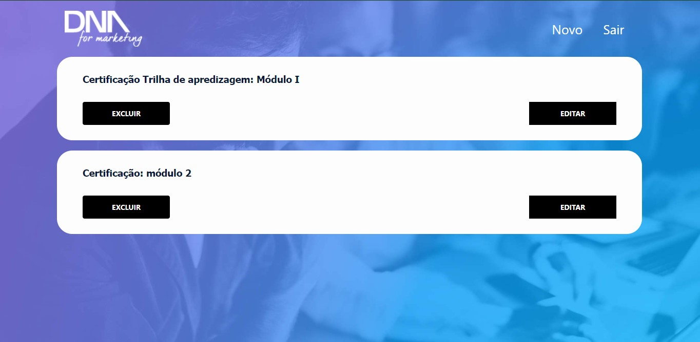
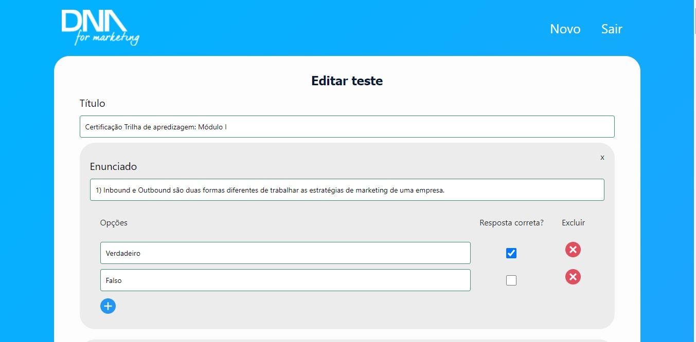
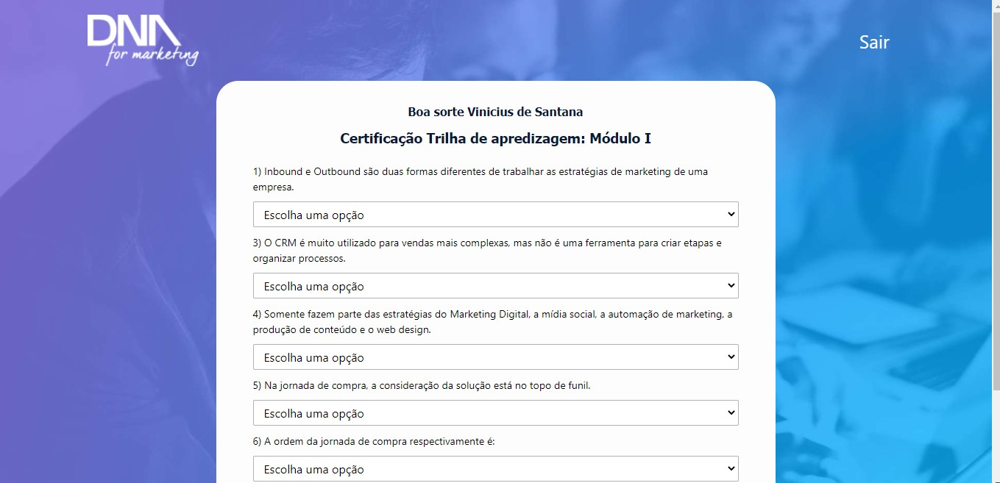

# Prova e certificação

Sistema para aplicar prova online e gerar o certificado de aprovação do aluno.

## Crie usuários

Criar usuário admin:

    php artisan make:adminuser

Cria usuário comum:

    php artisan make:user
## Telas

Tela de login

Tela de administração: lista os testes

Tela de administração: edita o teste

Tela de usuário: lista os testes

Tela de usuário: aplicação do teste

## Licence
CC BY-NC

Licenciado para DNA for Marketing